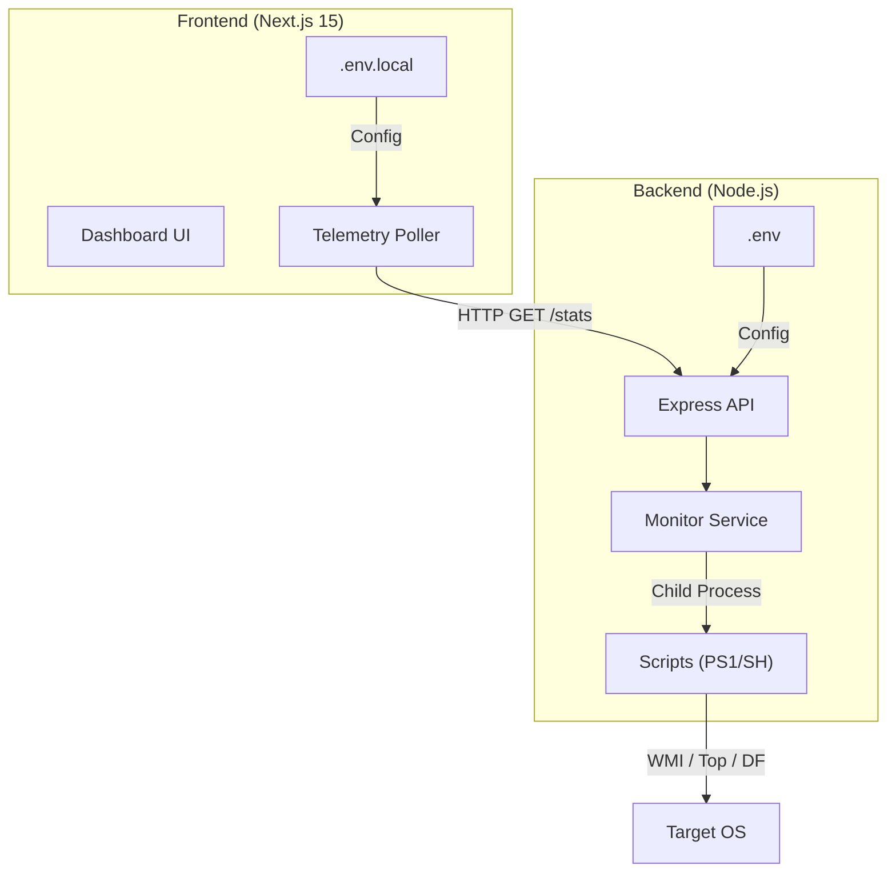

# 🖥️ System Monitor Dashboard

> **A high-performance, real-time hardware telemetry suite built with Next.js and Node.js.**

The System Monitor Dashboard provides deep, low-latency visibility into system performance with a premium, motion-driven interface. Designed for scalability and modularity, it leverages native OS telemetry to deliver 100ms sampling rates with minimal overhead.

---

## 🚀 Core Features

- **🌐 Dynamic Hardware Detection**: Instant identification of host-specific CPU model, core/thread topology, and cache architecture.
- **📊 Advanced Telemetry UI**: High-fidelity data visualization using dark-mode glassmorphism and reactive charts.
- **⚡ Performance Optimization**: Integrated overclocking potential analysis and stability tracking.
- **🔔 Intelligent Alerting**: Visual and auditory notifications for system threshold breaches (CPU/Memory/Disk).
- **🛠️ Extensible Architecture**: Plug-and-play component system for adding new hardware metrics.

---

## 🏗️ System Architecture

The project is architected for clean separation of concerns, decoupling data collection from the presentation layer.



---

## 🛠️ Technology Stack

| Layer | Technologies |
| :--- | :--- |
| **Frontend** | Next.js 15 (App Router), React 19, Motion, Recharts, Tailwind CSS |
| **Backend** | Node.js, Express, Dotenv, Morgan |
| **Telemetry** | PowerShell 7+, Bash, WMI, Unix Utilities |
| **Standards** | TypeScript, ESLint, Environment-Driven Config |

---

## 📦 Quick Start Guide

### 1. Prerequisites
- Node.js 18+
- Git
- Windows (PowerShell) or Unix-based OS

### 2. Environment Configuration
The project uses decoupled environment variables to ensure zero-secret commits.

```bash
# In Root
cp .env.example .env.local

# In /system-monitor-backend
cp .env.example .env
```

### 3. Installation & Execution
```bash
# Clone the repository
git clone <repo-url>
cd system-monitor-dashboard

# Install & Start Frontend
npm install && npm run dev

# Install & Start Backend (separate terminal)
cd system-monitor-backend
npm install && node server.js
```

---

## 👨‍💻 Contributing

We welcome professional contributions! Whether it's adding new telemetry metrics or improving UI/UX, please refer to the [CONTRIBUTING.md](CONTRIBUTING.md) for our standards and workflow.

---

## 🛡️ Security & Scalability

- **Modular Design**: Components are organized by feature area (`monitor`, `common`).
- **Stateless API**: The backend implements a lightweight caching layer for high-frequency requests.
- **Zero-Secret Baseline**: All ports and API endpoints are environment-driven.

---

*Verified Hardware Monitoring v1.0.0*
